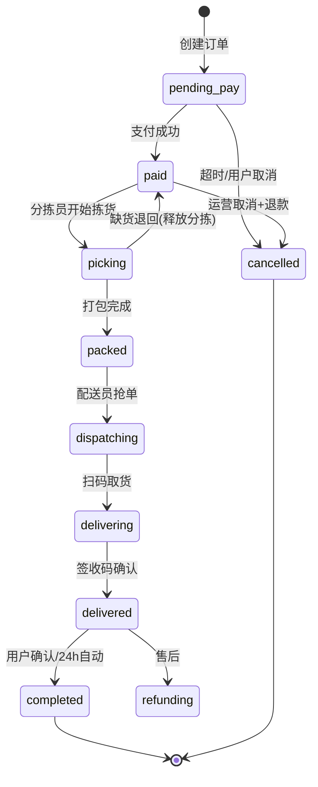
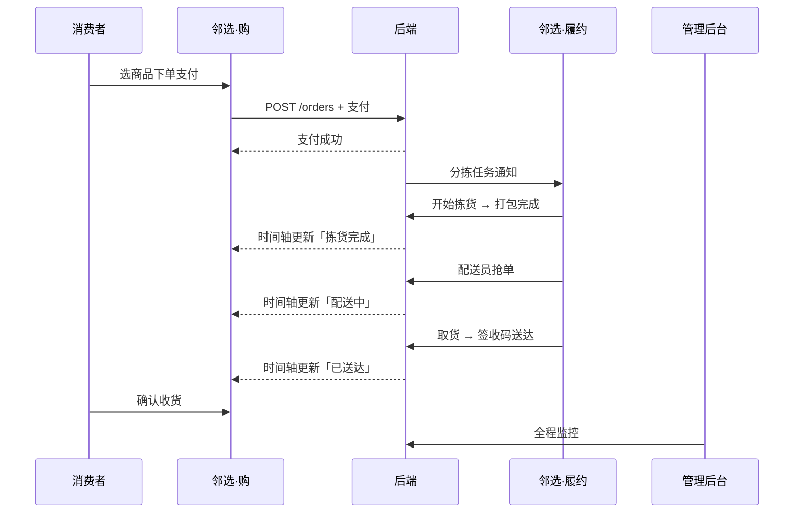

# NeighbroHub MVP 详细设计 · 单仓单小区

> 版本: v1.0 | 日期: 2026-06-08 | 依赖: [SDD-SPEC.md v3.0](./SDD-SPEC.md)

---

## 1. MVP 范围锁定

### 1.1 场景设定（种子运营环境）

| 项目 | MVP 取值 | 说明 |
|------|----------|------|
| 服务范围 | **山屿西山著**（东区 + 西区） | MVP 单仓覆盖两个分区 |
| 前置仓 | **山屿西山著地下仓**（1 个） | 地下车库 B1，服务东、西区全部楼栋 |
| 配送范围 | 山屿西山著东区、西区全部楼栋 | 围栏按分区配置 |
| 配送方式 | **仅送货上门** | 去掉团长自提；简化下单页 |
| 配送时效承诺 | 下单后 **2 小时内送达** | 首页/下单页展示「预计 HH:mm 前送达」 |
| 营业时间 | 08:00 ~ 21:00 | 非营业时间可浏览，不可下单 |
| 支付方式 | 微信支付 | MVP 必做 |
| 抢单模式 | 开放注册 + 后台审核 | 小区内业主/兼职均可申请配送员 |

### 1.2 MVP 做 / 不做

| ✅ MVP 必做 | ❌ MVP 不做（二期） |
|------------|-------------------|
| 商品浏览、购物车、下单支付 | 优惠券（`COUPONS`） |
| 配送全链路状态 + 时间轴 | 地图实时追踪配送员 |
| 入库扫码、分拣、打包 | 自动波次聚合（MVP 单笔即时分拣） |
| 配送抢单、取货、送达 | 多仓、跨小区 |
| 管理后台：商品/订单/库存/配送员 | 数据大屏、BI |
| **积分商城**（`MVP_FEATURES.POINTS=true`） | 拼团、团长分销（`DISTRIBUTION`） |
| 微信订阅消息（4 个节点） | 楼长分销、虚拟号联系骑手 |
| 缺货人工处理 | 缺货自动退款 |
| 签收码送达确认 | 拍照 OCR、电子签名 |

### 1.3 成功标准（内测验收）

1. 消费者在山屿西山著（东/西区）地址下单并支付成功
2. 分拣员在履约端完成拣货，订单进入抢单池
3. 配送员抢单 → 取货 → 送达，消费者时间轴同步更新
4. 管理员在后台可查看全链路订单与库存变化
5. 端到端耗时 ≤ 2 小时（人工操作下）

---

## 2. 组织与权限

### 2.1 MVP 角色人员配置（建议）

| 角色 | 人数 | 账号来源 |
|------|------|----------|
| 运营管理员 | 1 | 后台账号密码 |
| 仓库主管 | 1 | 履约端 + 后台 |
| 入库员 | 1 | 履约端（可与主管同人） |
| 分拣员 | 1～2 | 履约端 |
| 配送员 | 3～5 | 履约端开放申请 |
| 消费者 | 种子用户 20+ | 购端小程序 |

### 2.2 权限矩阵

| 能力 | 消费者 | 入库员 | 分拣员 | 配送员 | 仓管 | 运营 |
|------|:------:|:------:|:------:|:------:|:----:|:----:|
| 浏览下单 | ✅ | — | — | — | — | — |
| 扫码入库 | — | ✅ | — | — | ✅ | — |
| 分拣打包 | — | — | ✅ | — | ✅ | — |
| 抢单配送 | — | — | — | ✅ | — | — |
| 审核配送员 | — | — | — | — | ✅ | ✅ |
| 商品上下架 | — | — | — | — | — | ✅ |
| 手动改订单 | — | — | — | — | ✅ | ✅ |
| 查看报表 | — | — | — | 仅自己 | 部分 | ✅ |

### 2.3 履约端 Tab 显示规则

```
用户登录 → 查询 staff_roles + courier_status
  ├─ 有 inbound  → 显示「入库」Tab
  ├─ 有 pick     → 显示「分拣」Tab
  ├─ courier=active → 显示「配送」Tab
  └─ 始终显示「我的」Tab

未审核配送员：配送 Tab 可见但显示「审核中」，抢单按钮禁用
无任何角色：引导页「申请加入」
```

---

## 3. 仓库与库存设计

### 3.1 单仓物理布局

```
山屿西山著地下仓 (WH001)
├── A 区 · 常温 (15-25°C)     库位 A-001 ~ A-099
├── B 区 · 冷藏 (2-8°C)       库位 B-001 ~ B-050
├── C 区 · 冷冻 (-18°C)       库位 C-001 ~ C-030
├── P 区 · 待发区             按订单号暂存打包完成商品
└── R 区 · 收货区             到货验收临时堆放
```

### 3.2 库存模型（MVP）

采用 **可售库存 + 预占库存** 两列，不按批次出库（批次仅记录溯源）：

```
可售库存 = 入库累计 - 损耗 - 已售确认扣减
预占库存 = 已下单未支付 + 已支付待拣货
可用库存 = 可售库存 - 预占库存   ← 前端展示、下单校验用
```

| 事件 | 库存变化 |
|------|----------|
| 创建订单（未支付） | 预占 +N，15 分钟未支付自动释放 |
| 支付成功 | 预占保持，进入分拣队列 |
| 分拣完成 | 可售 -N，预占 -N |
| 取消订单（支付后） | 预占 -N，可售不变 |
| 入库确认 | 可售 +N |
| 缺货取消 | 退款 + 释放预占 |

### 3.3 MVP 商品规模建议

| 分类 | SKU 数 | 示例 |
|------|--------|------|
| 生鲜果蔬 | 15 | 西红柿、鸡蛋、牛奶 |
| 零食饮料 | 20 | 农夫山泉、薯片 |
| 粮油调味 | 15 | 大米、酱油 |
| 日用百货 | 10 | 纸巾、垃圾袋 |
| **合计** | **~60 SKU** | 够内测，拣货路径可手工优化 |

---

## 4. 订单状态机（详细版）

### 4.1 状态定义



### 4.2 状态变更触发者与副作用

| 事件 | 触发者 | 状态变化 | 副作用 |
|------|--------|----------|--------|
| `ORDER_CREATED` | 系统 | → pending_pay | 预占库存；生成 6 位签收码 |
| `PAY_SUCCESS` | 微信回调 | → paid | 写 status_log；推送「备货中」；创建 pick_task |
| `PICK_START` | 分拣员 | paid → picking | 记录 picker_id、started_at |
| `PICK_COMPLETE` | 分拣员 | picking → packed | 生成取货码；进入抢单池；推送「待配送」 |
| `SHORTAGE_REPORT` | 分拣员 | picking → paid | 通知运营；暂停自动分拣 |
| `GRAB_ORDER` | 配送员 | packed → dispatching | Redis 锁；绑定 courier_id |
| `PICKUP_SCAN` | 配送员 | dispatching → delivering | 记录 pickup_at；推送「配送中」 |
| `DELIVER_CONFIRM` | 配送员 | delivering → delivered | 校验签收码；推送「已送达」 |
| `CONFIRM_RECEIVE` | 消费者/系统 | delivered → completed | 配送费结算；订单关闭 |
| `CANCEL_UNPAID` | 系统/用户 | pending_pay → cancelled | 释放预占 |
| `CANCEL_PAID` | 运营 | paid/picking → cancelled | 退款 + 释放库存 |

### 4.3 消费者 Tab 与状态映射

| 订单列表 Tab | 包含状态 |
|-------------|----------|
| 待付款 | pending_pay |
| 备货中 | paid, picking, packed |
| 配送中 | dispatching, delivering |
| 已完成 | completed |
| 售后 | refunding, refunded, cancelled |

### 4.4 配送时间轴节点（固定 5 步）

| 步骤 | 对应状态 | 文案 |
|------|----------|------|
| 1 | pending_pay → paid | 订单已支付 |
| 2 | paid → picking | 仓库正在拣货 |
| 3 | packed → dispatching | 等待配送员接单 |
| 4 | dispatching → delivering | 配送员正在赶来 |
| 5 | delivering → delivered | 商品已送达 |

> 每步展示 `order_status_logs` 中首次到达该阶段的 `created_at`。

---

## 5. 业务规则参数

### 5.1 下单规则

| 参数 | MVP 默认值 | 可配置 |
|------|-----------|--------|
| 起送价 | ¥1 | 后台 |
| 基础配送费 | ¥0（内测免配送费） | 后台 |
| 配送员抢单收入 | ¥5/单（内测固定） | 后台 |
| 未支付超时 | 15 分钟 | 后台 |
| 最大下单重量 | 15 kg/单 | 后台 |
| 营业时间 | 08:00-21:00 | 后台 |

### 5.2 配送抢单规则

| 参数 | MVP 默认值 |
|------|-----------|
| 同时持单上限 | 100 单 |
| 抢单后取货超时 | 20 分钟（超时释放） |
| 送达后自动完成 | 24 小时未确认则 completed |
| 配送员在线 | 手动切换在线/离线 |
| 抢单范围 | 仅山屿西山著东、西区（按下单时间 FIFO） |

### 5.3 签收码规则

- 支付成功时生成 **6 位数字签收码**，展示在消费者订单详情
- 配送员送达时输入签收码，错误 3 次锁定 5 分钟
- MVP 不做短信转发，消费者当面报码或订单页展示给配送员看

---

## 6. 消费者端「邻选·购」页面设计

### 6.1 页面清单

| 页面 | 路径 | MVP 改动 |
|------|------|----------|
| 首页 | `pages/index` | 加「预计 2 小时达」、营业状态 |
| 商品详情 | `pages/detail` | 保留赏味期标签 |
| 购物车 | `pages/cart` | 校验可用库存 |
| 下单确认 | `pages/order` | **去掉自提**；加预计送达时间 |
| 订单列表 | `pages/orders` | Tab 改为备货中/配送中 |
| 订单详情 | `pages/orders/detail` 【新增】 | 商品清单 + 入口到追踪 |
| **配送追踪** | `pages/track` 【新增】 | 时间轴 + 签收码 + 配送员 |
| 地址管理 | `pages/address` 【新增】 | 楼栋门牌 |
| 个人中心 | `pages/profile` | **隐藏**分销/积分入口 |
| 绑定地址 | `pages/bind-community` | 固定山屿西山著，选择东区/西区 |

### 6.2 关键页面线框说明

#### 首页顶部

```
┌─────────────────────────────────────┐
│ 📍 山屿西山著  ▼                   │
│ 🕐 预计 16:30 前送达  ·  营业中       │
├─────────────────────────────────────┤
│ [Banner]                             │
│ [分类图标 2行×5]                      │
│ [商品列表...]                        │
└─────────────────────────────────────┘
```

#### 下单确认页（改造重点）

```
┌─────────────────────────────────────┐
│ 收货地址                             │
│ 山屿西山著东区 3栋 2单元 501  李明 138****  │
├─────────────────────────────────────┤
│ 预计送达  今天 16:30 前              │
├─────────────────────────────────────┤
│ 商品清单 (3件)                       │
│ ...                                  │
├─────────────────────────────────────┤
│ 商品金额        ¥45.80              │
│ 配送费          ¥0.00               │
│ 实付            ¥45.80              │
├─────────────────────────────────────┤
│ 备注 [可选]                          │
│         [ 微信支付 ¥45.80 ]          │
└─────────────────────────────────────┘
```

#### 配送追踪页 `pages/track` ⭐

```
┌─────────────────────────────────────┐
│  订单配送中                          │
│  预计 16:30 前送达                   │
├─────────────────────────────────────┤
│  ● 配送员正在赶来                    │
│  │  张师傅 · 138****1234            │
│  │  14:18                           │
│  ○ 仓库已完成拣货                    │
│  │  14:10                           │
│  ○ 订单已支付                        │
│  │  14:02                           │
├─────────────────────────────────────┤
│  签收码  8 3 6 2 9 1                │
│  送达时向配送员出示                   │
├─────────────────────────────────────┤
│  配送地址：山屿西山著东区 3栋501            │
│  [ 联系客服 ]                        │
└─────────────────────────────────────┘
```

### 6.3 常量迁移计划

现有 `ORDER_STATUS` 需扩展（实现阶段改 `constants.ts`）：

```typescript
export const ORDER_STATUS = {
  PENDING_PAY: 'pending_pay',
  PAID: 'paid',               // 备货中
  PICKING: 'picking',         // 拣货中
  PACKED: 'packed',           // 待配送
  DISPATCHING: 'dispatching', // 已接单
  DELIVERING: 'delivering',   // 配送中
  DELIVERED: 'delivered',     // 已送达
  COMPLETED: 'completed',
  CANCELLED: 'cancelled',
  REFUNDING: 'refunding',
  REFUNDED: 'refunded',
};
```

---

## 7. 履约端「邻选·履约」页面设计

### 7.1 页面清单

| 页面 | 路径 | 说明 |
|------|------|------|
| 登录 | `pages/login` | 微信登录 |
| 申请入驻 | `pages/apply` | 选角色、填实名 |
| 工作台 | `pages/home` | 今日概览、快捷入口 |
| 入库列表 | `pages/inbound/list` | 待入库任务 |
| 入库操作 | `pages/inbound/scan` | 扫码录入 |
| 分拣列表 | `pages/pick/list` | 待拣订单 |
| 分拣详情 | `pages/pick/detail` | 拣货清单 + 扫码复核 |
| 抢单大厅 | `pages/delivery/pool` | 待配送订单 |
| 配送中 | `pages/delivery/active` | 当前持单 |
| 送达确认 | `pages/delivery/confirm` | 签收码 + 拍照 |
| 我的 | `pages/mine` | 收入、角色、在线状态 |

### 7.2 TabBar 结构

```
[ 工作台 ]  [ 入库* ]  [ 分拣* ]  [ 配送* ]  [ 我的 ]
              * 按角色动态显示，最少只显示「工作台」「我的」
```

### 7.3 关键页面线框

#### 抢单大厅

```
┌─────────────────────────────────────┐
│  🟢 在线接单中          [切换离线]   │
├─────────────────────────────────────┤
│  待配送 3 单 · 持单 1/100              │
├─────────────────────────────────────┤
│ ┌─────────────────────────────────┐ │
│ │ #20260608001  3栋501  3件       │ │
│ │ 下单 14:10  配送费 ¥5   [抢单]  │ │
│ └─────────────────────────────────┘ │
│ ┌─────────────────────────────────┐ │
│ │ #20260608002  西区7栋1202  5件      │ │
│ │ 下单 14:15  配送费 ¥5   [抢单]  │ │
│ └─────────────────────────────────┘ │
└─────────────────────────────────────┘
```

#### 分拣详情（按库位排序）

```
┌─────────────────────────────────────┐
│  订单 #20260608001                   │
│  山屿西山著东区 3栋501 · 3件商品            │
├─────────────────────────────────────┤
│  ☐ 农夫山泉×2    A-012  常温        │
│  ☐ 西红柿 500g   B-003  冷藏  🥬   │
│  ☐ 薯片          A-045  常温        │
├─────────────────────────────────────┤
│  [ 缺货上报 ]    [ 打包完成 ]        │
└─────────────────────────────────────┘
```

#### 入库扫码

```
┌─────────────────────────────────────┐
│  [ 扫描商品条码 ]                    │
├─────────────────────────────────────┤
│  商品：农夫山泉 550ml×24              │
│  数量：[ 10 ]                        │
│  生产日期：[ 2026-05-01 ]            │
│  库位：[ A-012 ▼ ]                   │
│         [ 确认入库 ]                 │
└─────────────────────────────────────┘
```

### 7.4 扫码场景

| 场景 | 码类型 | 内容示例 |
|------|--------|----------|
| 商品 | SKU 条形码 | EAN-13 |
| 取货确认 | 订单取货码 QR | `PICK:ORD20260608001` |
| 库位 | 库位码 QR | `LOC:A-012` |

---

## 8. 管理后台页面设计

### 8.1 菜单结构（MVP）

```
仪表盘
├── 商品管理
│   ├── 分类管理
│   └── 商品列表
├── 库存管理
│   ├── 库存查询
│   ├── 入库记录
│   └── 库位管理
├── 订单中心
│   ├── 订单列表
│   └── 履约监控（简化看板）
├── 配送管理
│   ├── 配送员审核
│   └── 配送记录
├── 仓库设置
│   └── 前置仓信息（单条）
└── 系统
    ├── 作业人员
    └── 管理员账号
```

### 8.2 仪表盘卡片

| 卡片 | 数据 |
|------|------|
| 今日 GMV | 已支付订单金额合计 |
| 今日订单 | 已支付订单数 |
| 待分拣 | status in (paid) |
| 待配送 | status = packed |
| 配送中 | status in (dispatching, delivering) |
| 平均履约时长 | 支付 → 送达，当日均值 |

### 8.3 履约监控看板（单页）

```
┌──────────┬──────────┬──────────┬──────────┐
│ 待分拣 5 │ 拣货中 2 │ 待配送 3 │ 配送中 4 │
└──────────┴──────────┴──────────┴──────────┘

订单号      状态      下单时间   分拣员   配送员   操作
20260608001 拣货中    14:02     王芳     -       [详情]
20260608002 配送中    13:50     王芳     张师傅   [详情]
```

---

## 9. API 详细设计（MVP）

### 9.1 通用约定

- Base URL: `/api/v1`
- 鉴权: `Authorization: Bearer <jwt>`
- 端标识 Header: `X-Client-Type: consumer | worker | admin`
- 响应格式:

```json
{
  "code": 0,
  "message": "ok",
  "data": {}
}
```

### 9.2 消费者端核心接口

#### GET `/community/current`
获取当前服务社区（MVP 固定返回山屿西山著及东/西区）

```json
{
  "id": "C001",
  "name": "山屿西山著",
  "warehouse": { "id": "WH001", "name": "山屿西山著地下仓" },
  "businessHours": { "open": "08:00", "close": "21:00" },
  "isOpen": true,
  "etaMinutes": 120
}
```

#### POST `/orders`
创建订单

```json
// Request
{
  "addressId": "ADDR001",
  "items": [{ "skuId": "SKU001", "quantity": 2 }],
  "remark": "放门口"
}

// Response
{
  "orderId": "ORD001",
  "orderNo": "20260608001",
  "payAmount": 45.80,
  "signCode": "836291",
  "payParams": { /* 微信 prepay */ }
}
```

#### GET `/orders/:id/track`
配送追踪

```json
{
  "orderNo": "20260608001",
  "status": "delivering",
  "etaText": "今天 16:30 前",
  "signCode": "836291",
  "courier": { "name": "张师傅", "phone": "138****1234" },
  "timeline": [
    { "step": "paid", "text": "订单已支付", "time": "2026-06-08 14:02:00", "done": true },
    { "step": "picking", "text": "仓库正在拣货", "time": "2026-06-08 14:05:00", "done": true },
    { "step": "dispatching", "text": "配送员正在赶来", "time": "2026-06-08 14:18:00", "done": true, "current": true },
    { "step": "delivered", "text": "商品已送达", "time": null, "done": false }
  ]
}
```

### 9.3 履约端核心接口

#### GET `/worker/dashboard`
工作台概览

```json
{
  "roles": ["pick", "delivery"],
  "courierStatus": "active",
  "todayStats": {
    "inboundCount": 12,
    "pickCount": 28,
    "deliveryCount": 15,
    "deliveryEarnings": 75.00
  }
}
```

#### GET `/wms/pick/tasks?status=pending`
待分拣列表

```json
{
  "list": [
    {
      "taskId": "PT001",
      "orderNo": "20260608001",
      "address": "3栋501",
      "itemCount": 3,
      "waitingMinutes": 8
    }
  ]
}
```

#### GET `/wms/pick/tasks/:id`
分拣详情（库位排序）

```json
{
  "taskId": "PT001",
  "orderNo": "20260608001",
  "items": [
    { "skuId": "SKU001", "name": "农夫山泉", "qty": 2, "location": "A-012", "zone": "normal", "picked": false },
    { "skuId": "SKU009", "name": "西红柿", "qty": 1, "location": "B-003", "zone": "cold", "picked": false }
  ]
}
```

#### POST `/wms/pick/tasks/:id/complete`
打包完成 → 生成取货码

```json
// Response
{ "pickupCode": "PICK:ORD20260608001", "orderStatus": "packed" }
```

#### GET `/delivery/pool`
抢单池（FIFO）

```json
{
  "online": true,
  "holdingCount": 1,
  "maxHold": 3,
  "list": [
    {
      "deliveryTaskId": "DT001",
      "orderNo": "20260608001",
      "address": "3栋501",
      "itemCount": 3,
      "fee": 5.00,
      "waitingMinutes": 12
    }
  ]
}
```

#### POST `/delivery/tasks/:id/grab`
抢单（Redis 锁 `delivery:grab:{orderId}`）

#### POST `/delivery/tasks/:id/deliver`
送达确认

```json
// Request
{ "signCode": "836291", "proofImage": "https://..." }
```

### 9.4 管理端核心接口

| 方法 | 路径 | 说明 |
|------|------|------|
| GET | `/admin/dashboard` | 仪表盘数据 |
| CRUD | `/admin/products` | 商品 |
| GET | `/admin/inventory` | 库存列表 |
| POST | `/admin/inbound` | 创建入库单（可代录入） |
| GET | `/admin/orders` | 订单筛选 |
| PUT | `/admin/orders/:id/status` | 手动改状态 |
| GET | `/admin/couriers` | 配送员列表 |
| PUT | `/admin/couriers/:id/approve` | 审核通过 |
| PUT | `/admin/couriers/:id/suspend` | 暂停接单 |

---

## 10. 数据库种子数据

### 10.1 主数据

```sql
-- 小区
INSERT INTO communities (id, name, address, city, status)
VALUES ('C001', '山屿西山著', '北京市海淀区山屿西山著', '北京市', 'active');

-- 前置仓
INSERT INTO warehouses (id, community_id, name, address, lat, lng, business_open, business_close)
VALUES ('WH001', 'C001', '山屿西山著地下仓', '山屿西山著地下车库B1', 39.980, 116.280, '08:00', '21:00');

-- 围栏（MVP 简化为 community_id 关联，不做真实 polygon）
INSERT INTO delivery_fences (id, warehouse_id, community_id, status)
VALUES ('F001', 'WH001', 'C001', 'active');
```

### 10.2 库位示例

| 库位码 | 区域 | 温区 |
|--------|------|------|
| A-012 | A | 常温 |
| A-045 | A | 常温 |
| B-003 | B | 冷藏 |
| C-001 | C | 冷冻 |

---

## 11. 消息推送（微信订阅消息）

| 触发点 | 模板场景 | 跳转页 |
|--------|----------|--------|
| 支付成功 | 订单状态通知 | 配送追踪 |
| 开始拣货 | 订单状态通知 | 配送追踪 |
| 配送员接单 | 配送通知 | 配送追踪 |
| 已送达 | 签收通知 | 订单详情 |

MVP 在下单支付页引导用户一次性订阅 4 类消息。

---

## 12. 异常流程

| 异常 | 处理流程 |
|------|----------|
| 分拣缺货 | 分拣员上报 → 后台收到提醒 → 运营联系用户换货/部分退款 → 手动恢复分拣 |
| 配送员取货超时 | 20 分钟未扫码 → 自动释放 → 回抢单池 |
| 联系不上用户 | 配送员点「异常上报」→ 运营电话介入 → 可放门口拍照送达 |
| 签收码错误 | 配送员重试 3 次 → 联系客服 → 运营后台强制确认 |
| 支付后运营取消 | 后台发起退款 → 释放库存 → 通知用户 |
| 非营业时间下单 | 前端拦截，提示营业时间 |

---

## 13. 实施排期（6 周）

| 周 | 后端 | 邻选·购 | 邻选·履约 | 管理后台 |
|----|------|---------|-----------|----------|
| W1 | 项目骨架、用户登录、商品 CRUD | 常量/状态改造、地址页 | 项目初始化、登录申请 | 项目初始化、登录 |
| W2 | 订单创建、支付回调、状态机 | 下单页改造、支付 | 入库模块 | 商品管理 |
| W3 | 库存、入库 API、pick_task | 配送追踪页 | 分拣模块 | 库存、入库记录 |
| W4 | 配送池、抢单锁、送达 | 订单 Tab 改造 | 抢单、配送 | 订单列表、履约看板 |
| W5 | 订阅消息、定时任务 | 联调、UI 打磨 | 联调 | 配送员审核 |
| W6 | 种子数据、压测 | 内测 | 内测 | 内测 + 验收 |

---

## 14. 附录：端到端时序



---

## 15. 变更记录

| 版本 | 日期 | 内容 |
|------|------|------|
| v1.0 | 2026-06-08 | 单仓单小区 MVP 详细设计初版 |
| v1.0.1 | 2026-06-08 | 原型 HTML 更新；消费端追踪页与状态常量落地 |
