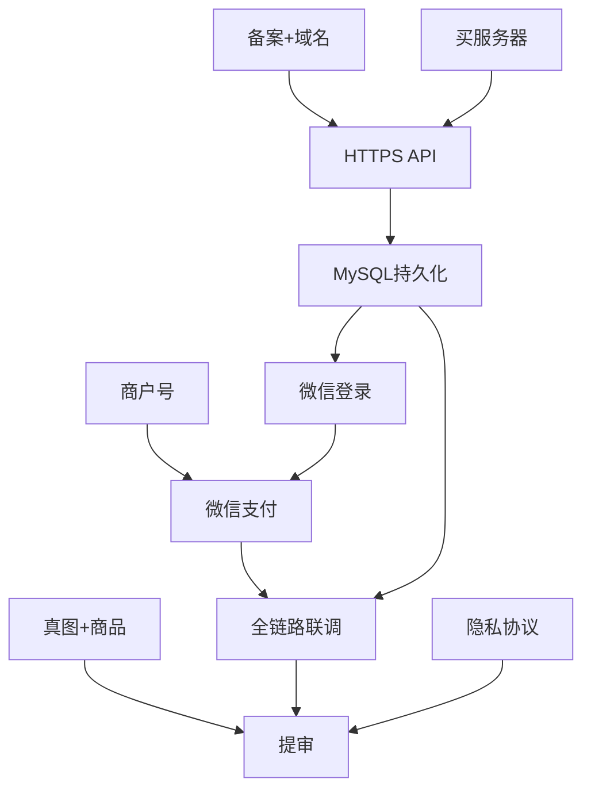

# NeighbroHub 实施路线图

> 从当前 MVP 到正式上架的**时间顺序、并行关系与里程碑**。  
> 与 [TODO.md](./TODO.md)、[LAUNCH-TODO.md](./LAUNCH-TODO.md) 配套；代码与文档对齐原则见 [CODE-DOC-SYNC.md](./CODE-DOC-SYNC.md)。

---

## 总览甘特（按周）

```
周次    1        2        3        4        5        6        7–8      9+
      ├────────┼────────┼────────┼────────┼────────┼────────┼────────┼────────►
A 备案  ████████████░░░░░░░░░░░░░░░░░░░░░░░░░░░░░░░░░░░░░░░░░░░░░░░░░░
B 服务器      ░░████████░░░░░░░░░░░░░░░░░░░░░░░░░░░░░░░░░░░░░░░░░░░░░░
C MySQL           ░░████████████░░░░░░░░░░░░░░░░░░░░░░░░░░░░░░░░░░░░░░
D 微信账号            ░░████████░░░░░░░░░░░░░░░░░░░░░░░░░░░░░░░░░░░░░░
E 登录/API                ░░██████░░░░░░░░░░░░░░░░░░░░░░░░░░░░░░░░░░░░
F 微信支付                    ░░████████░░░░░░░░░░░░░░░░░░░░░░░░░░░░░░
G 真图/内容                       ░░██████░░░░░░░░░░░░░░░░░░░░░░░░░░
H 联调测试                            ░░████████░░░░░░░░░░░░░░░░░░░░
I 提审上线                                ░░████░░░░░░░░░░░░░░░░░░░░
J 订阅消息/监控（可并行）    ░░░░░░░░░░░░░░░░████████████░░░░░░░░░░░░
```

**图例**：`█` 主路径必须完成 · `░` 可与其他线并行

---

## 阶段 0 · 当前基线（已完成）

| 项 | 状态 |
|----|------|
| 四端 UI + 统一 API（内存） | ✅ |
| 东 21 栋 / 西 17 栋绑定 | ✅ |
| 积分商城、作业 TabBar | ✅ |
| 环境变量模板、CI、文档骨架 | ✅ |
| API 失败不再静默 Mock（部分页面） | ✅ 持续完善 |

**里程碑 M0**：本地四端联调通过 `npm run test:ui` + 手工走通下单→分拣→配送。

---

## 阶段 1 · 基础设施（第 1–3 周）

> **目标**：有可用的 HTTPS API，重启不丢数据。

| # | 任务 | 预估 | 依赖 | 可并行 |
|---|------|------|------|--------|
| 1.1 | 购买云服务器（2C4G 华北） | 1 天 | 无 | 与 1.2 同时启动 |
| 1.2 | 购买域名 + **ICP 备案** | 7–20 工作日 | 无 | ⚡ 与 1.1 并行（备案最耗时） |
| 1.3 | Nginx + SSL + `api.xxx.com` | 1–2 天 | 1.2 备案通过 | — |
| 1.4 | MySQL 建库 + 表结构 | 3–5 天 | 1.1 | ⚡ 与 1.2 备案等待期并行设计表 |
| 1.5 | Server 持久化（替换 `store`） | 5–7 天 | 1.4 | — |
| 1.6 | 四端 `TARO_APP_API` / `VITE_API_BASE` 指正式域名 | 0.5 天 | 1.3 | ⚡ 与 1.5 后期并行 |
| 1.7 | PM2 / Docker 部署 + 健康检查 | 1 天 | 1.3, 1.5 | — |

**里程碑 M1**：`curl https://api.xxx.com/api/v1/health` 正常；重启服务后订单仍在。

**并行建议**：
- **备案等待期**：做 1.4 表设计、1.5 开发、商品真图拍摄（阶段 3 内容）
- **不要等 MySQL 完成才买服务器**——可先买机装 Docker，内网开发

---

## 阶段 2 · 微信生态（第 2–5 周，与阶段 1 部分重叠）

| # | 任务 | 预估 | 依赖 | 可并行 |
|---|------|------|------|--------|
| 2.1 | 注册企业主体 + **两个小程序 AppID** | 3–5 天 | 营业执照 | ⚡ 与备案并行 |
| 2.2 | 小程序认证（×2） | 3 天 | 2.1 | — |
| 2.3 | 配置 request 合法域名 | 0.5 天 | 1.3, 2.2 | — |
| 2.4 | 消费者微信登录（code→openid） | 2–3 天 | 1.5, 2.1 | ⚡ 后端可与 1.5 并行 |
| 2.5 | 作业员登录与角色 | 2–3 天 | 2.4 | — |
| 2.6 | 手机号授权 | 1–2 天 | 2.4 | ⚡ 与 2.5 并行 |
| 2.7 | 开通微信商户号 | 5–10 天 | 对公账户 | ⚡ 与 2.1 同时申请 |
| 2.8 | 微信支付 + 回调 | 5–7 天 | 2.7, 1.3 | — |
| 2.9 | 隐私政策 / 用户协议页 | 1–2 天 | 无 | ⚡ **任意时刻可写** |

**里程碑 M2**：体验版真机完成「登录 → 下单 → 真实微信支付 → 作业端履约」。

**并行建议**：
- 2.7 商户号审核期间做 2.4 登录、2.9 协议页
- 2.8 支付与 1.5 持久化可不同人并行，联调需两者都完成

---

## 阶段 3 · 内容与体验（第 3–6 周）

| # | 任务 | 预估 | 依赖 | 可并行 |
|---|------|------|------|--------|
| 3.1 | 商品主图 / 详情图上传 OSS | 3–7 天 | OSS 账号 | ⚡ 备案期即可拍图 |
| 3.2 | 管理后台商品录入联动 | 2–3 天 | 1.5 | — |
| 3.3 | Banner 运营图 | 1 天 | 3.1 | ⚡ |
| 3.4 | JWT 全路由鉴权 | 3–5 天 | 2.4 | ⚡ 与 3.2 并行 |
| 3.5 | 订阅消息 4 节点 | 2–3 天 | 2.8 | — |
| 3.6 | 地址服务端统一 | 2 天 | 1.5 | ⚡ |
| 3.7 | 管理后台去 Mock、接真实 API | 3–5 天 | 1.5, 3.4 | — |

**里程碑 M3**：无 Emoji 商品图；后台改价后小程序即时生效。

---

## 阶段 4 · 测试与上架（第 6–8 周）

| # | 任务 | 预估 | 依赖 |
|---|------|------|------|
| 4.1 | 按 [TEST-CHECKLIST.md](./TEST-CHECKLIST.md) 全量测试 | 3–5 天 | M2, M3 |
| 4.2 | 体验版 5–10 人试运营 | 7 天 | 4.1 |
| 4.3 | 修复试运营问题 | 3–5 天 | 4.2 |
| 4.4 | 提交微信审核（消费者 + 作业） | 3–7 天 | 4.3 |
| 4.5 | 正式版发布 + 监控告警 | 1 天 | 4.4 |

**里程碑 M4**：正式版上线，单小区限量 SKU 灰度。

---

## 阶段 5 · 二期（上架后）

| 任务 | 说明 |
|------|------|
| 分销 / 优惠券 | `MVP_FEATURES.DISTRIBUTION / COUPONS` |
| GPS 围栏 | 自动判断配送范围 |
| 多社区 / 多仓 | 扩展 `MVP_COMMUNITY` 模型 |
| API 集成测试 | supertest + CI |
| Spring Boot 迁移 | 日单 >2000 再评估 |

---

## 依赖关系简图



---

## 人力与并行（小团队 2–3 人示例）

| 角色 | 第 1–2 周 | 第 3–4 周 | 第 5–6 周 |
|------|-----------|-----------|-----------|
| **后端** | MySQL + 持久化 + 登录 | 支付回调 + JWT | 订阅消息 + 联调 |
| **前端/小程序** | 真图替换 + 协议页 | 支付调起 + 域名配置 | 测试修复 + 提审材料 |
| **运营/产品** | 备案材料 + 商品拍摄 | 体验版招募 + SKU | 客服 SOP + 灰度 |

**可完全并行、不互相阻塞**：
- 备案 ⟷ 表结构设计 ⟷ 商品摄影 ⟷ 隐私协议文案 ⟷ 商户号申请

**必须串行**：
- 备案通过 → HTTPS 域名 → 小程序合法域名  
- MySQL → 持久化 API → 支付/订单联调  
- 全链路通过 → 提审  

---

## 文档维护节奏

| 何时 | 更新什么 |
|------|----------|
| 每完成一个里程碑 | [TODO.md](./TODO.md) 勾选 + 本文件里程碑日期 |
| 改功能开关 / API | [CODE-DOC-SYNC.md](./CODE-DOC-SYNC.md) 清单 |
| 上架前 | [TEST-CHECKLIST.md](./TEST-CHECKLIST.md) 全勾 |
| 部署变更 | [ENV.md](./ENV.md) + `*.env.example` |

---

*预估总周期：有备案经验、2 人小团队约 **6–8 周** 可试运营；备案若 20 天则整体 +2 周。*
