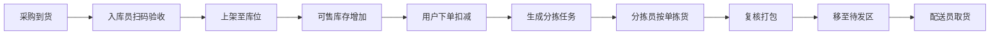

# NeighbroHub 社区前置仓即时配送平台 - 规范驱动开发文档 (SDD)

> 版本: v3.0 | 日期: 2026-06-08 | 状态: **MVP 演示版**（四端联调，内存存储，模拟支付/登录）
>
> **MVP 范围**：单仓（山屿西山著地下仓）+ 山屿西山著（东区·西区）→ 详见 [MVP-DESIGN.md](./MVP-DESIGN.md)

---

## 1. 产品概述

### 1.1 产品定位

面向单个或多个社区的**前置仓生鲜/日用品即时配送平台**，对标小象超市模式：

- 用户在小程序下单，由**社区前置仓**完成拣货打包
- **开放配送员抢单**，任何人经审核后可接单配送
- 运营方通过 **Web 管理后台** 管理商品、库存、订单、仓库与配送

与 v2.0「团长私域分销」的差异：核心从「社交裂变卖货」转为「仓配效率 + 配送时效」。

### 1.2 对标参考：小象超市核心能力

| 能力 | 小象超市 | NeighbroHub 目标 |
|------|----------|------------------|
| 配送时效 | 30 分钟～1 小时达 | MVP：2 小时内达；二期：预约时段 + 更快履约 |
| 履约可视化 | 下单→拣货→出库→配送→送达 | 全链路状态推送 + 时间轴 |
| 仓储 | 前置仓 + 冷链分区 | 单仓起步，支持常温/冷藏/冷冻分区 |
| 配送 | 专职骑手 | **开放抢单**（兼职/全职均可） |
| 服务范围 | 电子围栏 | 按小区/楼栋围栏 |

### 1.3 端形态决策（推荐）

| 端 | 形态 | 说明 |
|----|------|------|
| **消费者端** | 微信小程序 | 浏览商品、下单支付、看配送进度 |
| **履约端** | 微信小程序（1 个） | 入库 + 分拣 + 配送，按角色展示不同工作台 |
| **管理端** | Web 后台 | 商品/库存/订单/仓配/人员/数据 |

**为何履约端合并为 1 个小程序？**

- 小团队常一人多岗（早班入库、高峰分拣、空闲配送）
- 共用登录、消息、扫码能力，维护成本最低
- 通过**角色权限**控制可见模块，而非拆成两个 App

**何时拆成 2 个履约小程序？**

- 仓库使用固定平板、配送员只用手机，且 UI 差异极大时
- 可拆为：`邻选·仓`（入库/分拣）+ `邻选·配`（抢单/配送）

**最终推荐：2 小程序 + 1 Web 后台**

```
┌─────────────┐   ┌─────────────┐   ┌─────────────┐
│ 邻选·购      │   │ 邻选·履约    │   │ 邻选·管理后台 │
│ (消费者)     │   │ (仓配履约)   │   │ (Web)        │
└──────┬──────┘   └──────┬──────┘   └──────┬──────┘
       │                 │                 │
       └─────────────────┼─────────────────┘
                         │
                  ┌──────▼──────┐
                  │  统一 API    │
                  │  订单/库存   │
                  └─────────────┘
```

### 1.4 核心用户角色

| 角色 | 使用端 | 职责 |
|------|--------|------|
| **消费者** | 邻选·购 | 浏览、下单、追踪配送、售后 |
| **入库员** | 邻选·履约 | 采购到货验收、扫码入库、库存调整 |
| **分拣员** | 邻选·履约 | 按订单拣货、复核、打包 |
| **配送员** | 邻选·履约 | 抢单/接单、取货、送达、签收 |
| **仓库主管** | 邻选·履约 + 管理后台 | 波次调度、异常处理、库存盘点 |
| **运营管理员** | 管理后台 | 商品、营销、订单、人员、数据 |
| **超级管理员** | 管理后台 | 系统配置、权限、多仓扩展 |

> 配送员采用**开放注册 + 后台审核**模式，审核通过即可在「配送」模块抢单，无需绑定单一团长。

---

## 2. 核心业务流程

### 2.1 订单全链路状态机

```
待支付 ──支付成功──► 待分拣 ──开始拣货──► 拣货中 ──打包完成──► 待配送
                                                              │
                    已取消 ◄── 超时/用户取消 ◄── 待支付        │
                                                              ▼
已完成 ◄── 用户确认/超时自动 ── 已送达 ◄── 配送中 ◄── 配送员接单
```

| 状态码 | 消费者文案 | 履约端动作 |
|--------|------------|------------|
| `pending_pay` | 待支付 | — |
| `paid` | 商家备货中 | 进入分拣队列 |
| `picking` | 正在拣货 | 分拣员领取/扫码拣货 |
| `packed` | 等待配送 | 放置取货区，进入配送池 |
| `dispatching` | 配送员已接单 | 配送员抢单成功 |
| `delivering` | 配送中 | 取货出发、更新位置 |
| `delivered` | 已送达 | 拍照/签收码确认 |
| `completed` | 已完成 | 结算配送费 |
| `cancelled` | 已取消 | 释放库存 |

### 2.2 仓储作业流



**波次策略（MVP 简化版）**

- 每 15～30 分钟聚合已支付订单生成一个**分拣波次**
- 或单笔订单支付后立即进入分拣队列（单量小时）
- 分拣完成后统一进入**配送抢单池**

### 2.3 配送抢单流

```
订单 packed → 进入配送池（展示：地址、距离、预估配送费、时效）
     ↓
配送员浏览/筛选 → 点击「接单」（先到先得 / 限同时持单数）
     ↓
到店取货（扫码确认）→ 配送中（可更新位置）→ 送达（签收码/拍照）
     ↓
配送费入账 → 订单 completed
```

**抢单规则（可配置）**

- 同时最多持有 N 单（默认 3）
- 服务半径内可抢（基于前置仓 GPS + 小区围栏）
- 超时未取货自动释放回池
- 差评/投诉过多自动暂停接单资格

### 2.4 消费者配送进度（对标小象时间轴）

```
✓ 订单已支付          14:02
✓ 仓库正在拣货        14:05
● 配送员正在赶来      14:18  ← 当前
○ 商品已送达          --
```

可选增强：地图展示配送员位置（二期）、预计送达倒计时。

---

## 3. 功能需求规格

### 3.1 消费者小程序「邻选·购」

> 基于现有 `mini-program/` 改造，弱化分销、强化即时配送体验。

#### C-001 用户与地址
- 微信授权登录 + 手机号
- 收货地址（楼栋/门牌/联系人）
- **服务范围校验**：下单前判断地址是否在前置仓配送围栏内
- 绑定服务小区（保留，用于围栏与商品可售范围）

#### C-002 首页与商品
- 分类导航（生鲜、零食、日用等）
- 商品列表/搜索
- 商品详情：规格、库存、保质期提示（已有 `warehouseZone` 等字段可复用）
- 预计送达时间展示（如「最快 2 小时送达」）
- Banner / 活动入口（秒杀等二期）

#### C-003 购物车与下单
- 购物车增删改、库存校验
- 订单确认：地址、商品、配送时段、备注
- 微信支付
- 起送价 / 配送费规则展示

#### C-004 订单与配送追踪 ⭐ 核心
- 订单列表（待付款 / 备货中 / 配送中 / 已完成 / 售后）
- **订单详情 + 配送时间轴**（全链路状态）
- 配送员信息（脱敏：姓氏 + 电话后四位）
- 联系配送员（虚拟号或平台中转，二期）
- 确认收货、评价、申请退款

#### C-005 个人中心
- 地址管理、客服入口
- 优惠券（二期）
- ~~楼长分销中心~~ → 移至二期可选模块，MVP 不展示

#### C-006 消息通知
- 订阅消息：支付成功、开始拣货、配送员接单、已送达

---

### 3.2 履约小程序「邻选·履约」

> 新建 `worker-mini-program/`，与消费端共用 Taro 技术栈与部分组件。

#### W-001 登录与身份
- 微信登录
- 首次使用选择申请角色：入库员 / 分拣员 / 配送员（可多选）
- 提交实名信息 → 后台审核 → 开通权限
- 已审核用户进入**角色工作台**（Tab 按权限动态显示）

#### W-002 入库模块（入库员）
- 今日待入库任务列表
- 扫码商品条码 / SKU → 录入数量、生产日期、批次
- 选择库位（常温 A 区 / 冷藏 B 区 / 冷冻 C 区）
- 入库单确认 → 可售库存 +
- 异常：破损、临期、拒收登记

#### W-003 分拣模块（分拣员）
- 待分拣波次 / 订单列表
- 领取分拣任务
- **拣货清单**：商品名、库位、数量（按库位路径排序）
- 扫码复核：逐件确认
- 打包完成 → 打印/展示取货码 → 状态变更为 `packed`
- 缺货上报 → 触发运营通知 / 自动退款（规则可配）

#### W-004 配送模块（配送员）⭐ 核心
- **抢单大厅**：待配送订单列表（距离、配送费、时效、商品件数）
- 一键接单 / 拒单释放
- 取货：到仓扫码确认取货
- 配送中：一键导航、更新状态、异常上报（联系不上用户等）
- 送达：输入用户签收码 / 拍照留证
- 我的配送：今日单量、收入、历史记录
- 配送员状态：在线/离线（仅在线可抢单）

#### W-005 通用
- 消息通知（新单、波次、异常）
- 简单统计（今日入库量、分拣量、配送量）

---

### 3.3 Web 管理后台「邻选·管理」

> 新建 `admin-web/`，React + Ant Design Pro。

#### B-001 仪表盘
- 今日 GMV、订单量、履约时效、配送中订单数
- 待处理：缺货、超时未分拣、超时未配送

#### B-002 商品管理
- 分类、SPU/SKU、价格、上下架
- 商品关联库位类型（常温/冷藏/冷冻）
- 批量导入

#### B-003 库存与仓储
- 实时库存、安全库存预警
- 入库单审核与记录
- 库位管理（区域-货架-层）
- 库存盘点、损耗登记

#### B-004 订单管理
- 订单列表筛选（状态、时间、小区）
- 手动改状态、取消、退款
- 分拣波次管理：创建/关闭波次、指派分拣员
- 配送单监控：谁在配送、超时预警

#### B-005 配送管理
- 配送员审核、启用/禁用
- 抢单规则配置（半径、持单上限、配送费）
- 配送费结算与对账
- 服务围栏（小区/楼栋地图圈选）

#### B-006 用户与权限
- 消费者列表
- 作业人员管理（角色、所属前置仓）
- RBAC：运营、仓管、财务、超管

#### B-007 前置仓管理
- 仓库信息（地址、营业时间、覆盖小区）
- 多仓扩展预留（MVP 单仓）

#### B-008 数据报表（二期）
- 商品销量、履约时长、配送员排行、损耗率

#### B-009 营销（二期，从 v2.0 继承）
- 优惠券、秒杀、积分商城

---

## 4. 技术架构

### 4.1 技术栈（MVP 务实选型）

```
┌──────────────────────────────────────────────────────┐
│ 前端                                                  │
├──────────────────────────────────────────────────────┤
│ 邻选·购      Taro 3 + React + TypeScript  (已有)      │
│ 邻选·履约    Taro 3 + React + TypeScript  (新建)      │
│ 管理后台     React 18 + Ant Design Pro    (新建)      │
└──────────────────────────────────────────────────────┘
                        ↕ HTTPS / REST
┌──────────────────────────────────────────────────────┐
│ 后端 MVP：单体优先，预留拆分                            │
├──────────────────────────────────────────────────────┤
│ Java 17 + Spring Boot 3.2                            │
│ 模块：user / product / inventory / order / delivery  │
│ 鉴权：JWT + 微信登录                                   │
│ 定时任务：波次生成、超时释放、自动完成订单               │
└──────────────────────────────────────────────────────┘
                        ↕
┌──────────────────────────────────────────────────────┐
│ 数据                                                  │
├──────────────────────────────────────────────────────┤
│ MySQL 8.0（主库）  Redis 7（缓存/锁/配送员在线状态）     │
│ MinIO（图片）      微信订阅消息                         │
│ 地图：腾讯位置服务（围栏、距离、导航）                   │
└──────────────────────────────────────────────────────┘
```

> v2.0 的微服务方案保留为 **Phase 3 扩展**，MVP 不引入 Nacos/ES/RabbitMQ，降低落地成本。

### 4.2 数据库核心表（新增/调整）

```sql
-- 前置仓
warehouses: id, name, address, lat, lng, coverage_radius, status

-- 库位
warehouse_locations: id, warehouse_id, zone(cold/normal/frozen), 
                     shelf_code, capacity, status

-- 库存（SKU 维度，含批次）
inventory: id, sku_id, warehouse_id, location_id, quantity, 
           batch_no, production_date, expire_date

-- 入库单
inbound_orders: id, warehouse_id, supplier, status, operator_id, created_at
inbound_items: id, inbound_order_id, sku_id, quantity, location_id, batch_no

-- 订单（扩展配送字段）
orders: id, order_no, user_id, warehouse_id, status, total_amount, pay_amount,
        address_snapshot, expected_delivery_at, delivery_fee,
        picker_id, courier_id, picked_at, packed_at, delivered_at

-- 订单商品
order_items: id, order_id, sku_id, quantity, price, picked_quantity

-- 分拣任务
pick_tasks: id, order_id, wave_id, picker_id, status, started_at, finished_at
pick_task_items: id, task_id, sku_id, location_id, required_qty, picked_qty

-- 分拣波次
pick_waves: id, warehouse_id, status, order_count, created_at

-- 配送任务
delivery_tasks: id, order_id, courier_id, status, grab_at, pickup_at, 
                delivered_at, delivery_fee, proof_image

-- 配送员
couriers: id, user_id, real_name, phone, id_card_hash, status(pending/active/suspended),
          warehouse_id, max_concurrent_orders, rating, total_deliveries

-- 作业人员（入库/分拣）
warehouse_staff: id, user_id, warehouse_id, roles(inbound/pick), status

-- 配送进度日志（消费者时间轴）
order_status_logs: id, order_id, from_status, to_status, operator_id, 
                   remark, created_at

-- 服务围栏
delivery_fences: id, warehouse_id, community_id, polygon_geojson, status
```

### 4.3 核心 API 分组

```
# 消费端
GET    /api/v1/products
POST   /api/v1/orders
GET    /api/v1/orders/:id/track          # 配送时间轴

# 履约端 - 入库
POST   /api/v1/wms/inbound
GET    /api/v1/wms/inbound/tasks

# 履约端 - 分拣
GET    /api/v1/wms/pick/tasks
POST   /api/v1/wms/pick/tasks/:id/start
POST   /api/v1/wms/pick/tasks/:id/complete

# 履约端 - 配送
GET    /api/v1/delivery/pool             # 可抢订单
POST   /api/v1/delivery/tasks/:id/grab   # 抢单
POST   /api/v1/delivery/tasks/:id/pickup
POST   /api/v1/delivery/tasks/:id/deliver

# 管理端
CRUD   /api/v1/admin/products|inventory|orders|couriers|warehouses
```

---

## 5. 项目结构（目标）

```
neighbrohub/
├── mini-program/              # 邻选·购（消费者）— 已有，按 v3.0 改造
│   └── src/pages/
│       ├── index/             # 首页
│       ├── detail/            # 商品详情
│       ├── cart/              # 购物车
│       ├── order/             # 下单确认
│       ├── orders/            # 订单列表
│       ├── track/             # 【新增】配送追踪时间轴
│       └── profile/           # 个人中心
├── worker-mini-program/       # 邻选·履约（仓配）— 新建
│   └── src/pages/
│       ├── home/              # 角色工作台入口
│       ├── inbound/           # 入库
│       ├── pick/              # 分拣
│       ├── delivery/          # 抢单与配送
│       └── mine/              # 收入与设置
├── admin-web/                 # 管理后台 — 新建
│   └── src/pages/
│       ├── dashboard/
│       ├── products/
│       ├── inventory/
│       ├── orders/
│       ├── warehouse/
│       └── couriers/
├── server/                    # 后端 — 新建
│   └── neighbrohub-api/       # Spring Boot 单体
└── docs/
    ├── SDD-SPEC.md            # 本文档
    └── design/
```

---

## 6. 开发路线图

### Phase 1: MVP 履约闭环（6～8 周）

**目标：单仓、单小区跑通「下单 → 入库 → 分拣 → 抢单配送 → 追踪」**

| 模块 | 任务 |
|------|------|
| 后端 | 用户/商品/订单/库存/配送 API；订单状态机；微信登录与支付 |
| 邻选·购 | 服务范围校验；下单支付；**配送时间轴页**；订单状态文案对齐 |
| 邻选·履约 | 入库扫码；分拣清单与完成；**抢单大厅 + 取货送达** |
| 管理后台 | 商品上下架；订单列表；配送员审核；基础库存查看 |
| 运营 | 1 个前置仓 + 3～5 名兼职配送员内测 |

### Phase 2: 效率与体验（4～6 周）

- 分拣波次自动聚合
- 配送员实时位置（地图）
- 订阅消息全链路推送
- 缺货自动处理、退款流程
- 配送费自动结算
- 数据报表、超时预警
- 优惠券 / 秒杀（从 v2.0 择优回归）

### Phase 3: 规模扩展（6～8 周）

- 多前置仓、跨仓库存
- 智能路径拣货、配送路线建议
- 会员积分（可选）
- 后端拆分为微服务（按业务量）
- 团长分销作为**补充获客渠道**（非主链路）

---

## 7. 与现有代码的迁移说明

| 现有资产 | v3.0 处理方式 |
|----------|---------------|
| `mini-program/` 商品/购物车/订单页 | **保留**，改订单状态与 UI 文案 |
| `pages/distribution/` 楼长分销 | MVP **隐藏**，Phase 3 可选 |
| `pages/points/` 积分商城 | Phase 2/3 可选 |
| `mockData` 仓储字段 | **复用**，对接真实库存 API |
| `ORDER_STATUS` 常量 | **扩展**为 v3.0 状态机 |
| `docs/design/*.html` | 待按新原型更新 |

---

## 8. 非功能性需求

| 指标 | MVP 目标 |
|------|----------|
| 下单接口 | P99 < 800ms |
| 抢单并发 | Redis 分布式锁，防重复接单 |
| 库存扣减 | 下单预占 → 支付确认扣减 → 取消释放 |
| 配送员位置 | 30s 上报一次（二期） |
| 数据安全 | 身份证等敏感信息加密存储 |

---

## 附录

### A. 术语表

| 术语 | 说明 |
|------|------|
| 前置仓 | 靠近社区的小型仓库，负责存储与分拣 |
| 波次 | 聚合一段时间内订单进行批量分拣 |
| 抢单池 | 已打包完成、等待配送员接单的订单集合 |
| 库位 | 仓库内具体存储位置编码 |
| 围栏 | 配送服务范围的地理边界 |

### B. 变更记录

| 版本 | 日期 | 变更内容 |
|------|------|----------|
| v1.0 | 2026-06-04 | 初始版本，社区私域购物 |
| v2.0 | 2026-06-04 | 积分系统、楼长分销 |
| v3.0 | 2026-06-08 | **战略转型**：小象超市类前置仓即时配送；新增履约小程序与仓配流程；弱化分销为二期可选 |
| v3.0.1 | 2026-06-08 | 锁定 MVP 单仓单小区；新增 [MVP-DESIGN.md](./MVP-DESIGN.md) 详细设计 |
